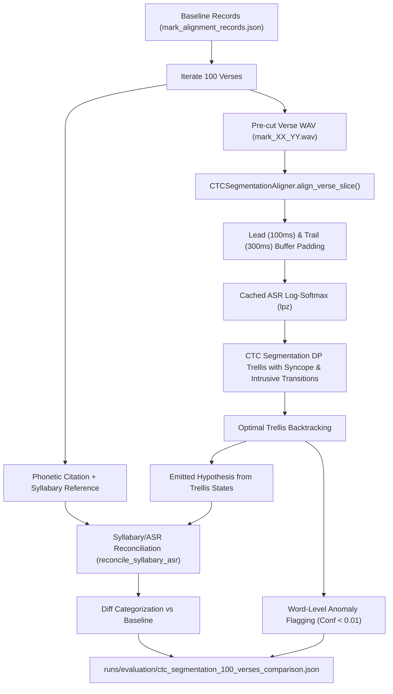
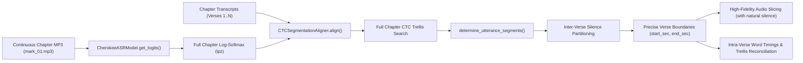

# CTC Segmentation Benchmarking Approach, Vowel Clipping Analysis, and Pipeline Alignment

## Executive Summary

This document provides a comprehensive technical breakdown of our current alignment and benchmarking architecture in `workshop-transcription`. It specifically investigates the root cause of final vowel clipping in verse audio clips, explains how the intra-verse CTC segmentation benchmark operates, contrasts our setup with the foundational research paper on CTC segmentation (*Kurzinger et al., 2020*), and outlines the migration plan to align our real New Testament Bible alignment pipeline with full-chapter continuous segmentation.

---

## 1. Root Cause Analysis: Final Vowel Clipping in Verse Audio Clips

### 1.1 The Critical Question
> **"Did we grab the start/end of the first/last word of the old alignment to crop, or did we use the VAD clips themselves?"**

### 1.2 Definitive Code-Traced Answer
**We cropped strictly to the start of the first matched word and the end of the last matched word from the old greedy ASR emissions—we did NOT use the VAD segment bounds.**

Furthermore, the old greedy emissions extractor systematically truncated the final word boundary to just **20 ms after the peak emission frame** of the final character.

### 1.3 Step-by-Step Breakdown of the Truncation Mechanism

1. **VAD Audio Segmentation (`transcription.audio.segment.segment_long_audio`):**
   - The chapter audio is segmented into VAD chunks based on energy profile (`silence_thresh = -40 dBFS`, `min_silence_len = 500 ms`, `keep_silence = 100 ms`).
   - Each VAD chunk retains a `100 ms` silence buffer at the beginning and end.

2. **Greedy CTC Decoding & Word Boundary Calculation (`transcription.models.asr_model.CherokeeASRModel.get_word_confidences`):**
   - For each VAD chunk, logits are computed and greedily decoded (`argmax` at each frame).
   - Frame timestamps are mapped at `20 ms` intervals (`i * 0.02s`).
   - In `get_word_confidences` (lines 540–575):
     ```python
     WordConfidence(
         word=current_word,
         confidence=word_conf,
         start_time=current_chars[0]["start_time"],
         end_time=round(current_chars[-1]["start_time"] + 0.02, 3), # <--- ONLY 1 FRAME (20ms) AFTER PEAK!
         chars=current_chars,
     )
     ```
   - **Crucial flaw:** The `end_time` of the word was defined as the frame index of the final character peak plus $0.02\text{ s}$. Any trailing acoustic energy, formant sustain, vowel resonance, glottal release, or breath pause after that single peak frame was discarded.

3. **Sliding Window DTW Matching (`transcription.alignment.aligner.SlidingWindowDTWAligner.align`):**
   - In `SlidingWindowDTWAligner.align` (lines 360–361):
     ```python
     chunk_start = matched_tokens[0].start_sec
     chunk_end = matched_tokens[-1].end_sec
     ```
   - The chunk boundary was assigned directly to `matched_tokens[0].start_sec` and `matched_tokens[-1].end_sec`. The surrounding VAD chunk boundary and its silence padding were completely ignored.

4. **Audio Slicing to Disk (`scripts/realign_bible.py`):**
   - In `realign_bible.py` (lines 166–188):
     ```python
     start_sec = round(chunk.start_sec, 3)
     end_sec = round(chunk.end_sec, 3)
     start_ms = int(start_sec * 1000)
     end_ms = int(end_sec * 1000)
     verse_audio = audio_seg[start_ms:end_ms]
     verse_audio.export(str(split_out_path), format="wav")
     ```
   - The exported audio file (`cherokee_new_testament/split_audio/mark_XX_YY.wav`) was sliced with millisecond precision to `start_sec` and `end_sec`.

### 1.4 Consequences for Benchmarking
Because `split_audio/mark_XX_YY.wav` was chopped immediately after the peak of the last character:
- Final vowels in open syllables (e.g., `-v`, `-i`, `-a`, `-o`) were amputated mid-vowel.
- When `CTCSegmentationAligner.align_verse_slice` evaluates these pre-cut files, the acoustic model finds little to no acoustic evidence for the final vowel at the file tail, frequently leading to syncope deletion transitions or low confidence flags at the final word boundary unless artificial lead/trail acoustic context buffers are applied.

---

## 2. Current Intra-Verse Benchmarking Architecture

### 2.1 Overview
The benchmark (`scripts/benchmark_ctc_segmentation_100_verses.py`) evaluates the `CTCSegmentationAligner` on 100 Bible verses from the Book of Mark.



### 2.2 Key Components of the Benchmark

1. **Acoustic Context Buffering (`buffer_lead_ms=100`, `buffer_trail_ms=300`):**
   - To counteract the final vowel clipping inherent in the pre-sliced WAVs, `CTCSegmentationAligner` prepends 100 ms and appends 300 ms of silence before computing ASR emissions.
   - Timings are mapped back to original audio coordinates by subtracting the lead offset: `w_start = raw_w_start - lead_offset_sec`.

2. **Disk-Cached Acoustic Log-Probabilities (`.cache/ctc_emissions`):**
   - High-dimensional acoustic posteriors $[T, V]$ are cached to disk as compressed `.npz` files using a deterministic hash of audio path, file modification time, model ID, and buffer configurations.
   - Reduces 100-verse benchmark runtime from $\sim 45\text{ s}$ to $< 1.5\text{ s}$.

3. **Syncope & Intrusive Token Trellis Transitions:**
   - **Syncope ($\lambda_{\text{syncope}} = 2.0$):** Allows skipping vowel states in $CV$ syllables to model fast spoken Cherokee vowel deletion.
   - **Intrusive Tokens ($\lambda_{\text{intrusive}} = 0.1$):** Allows optional insertion of laryngeal features ($h$, glottal stop $'$) not present in citation spelling.

4. **Trellis Path Hypothesis Harvesting:**
   - Rather than using raw greedy ASR decoding, the emitted text is gathered directly from the optimal backtracked state path in the CTC trellis.
   - This hypothesis is fed to `reconcile_syllabary_asr` to produce an enriched phonological surface form.

5. **Anomaly & Typo Detection:**
   - Word confidence is calculated from the geometric mean of character state log-probabilities ($e^{\frac{1}{K}\sum \ln p}$).
   - Words with confidence $< 0.01$ or zero aligned frames are flagged for manual review.

---

## 3. Contrast with the CTC-Segmentation Research Paper

### 3.1 Research Reference
> **Paper:** *CTC-Segmentation of Large Corpora for German End-to-End Speech Recognition* (Kurzinger, Zhou, et al., 2020 / Interspeech 2020)

### 3.2 Architectural Comparison

| Dimension | CTC-Segmentation Paper (*Kurzinger et al.*) | Current Workshop Benchmark | Target Full Bible Pipeline |
| :--- | :--- | :--- | :--- |
| **Input Audio Scope** | Continuous, long-form unsegmented audio (full chapters, audiobooks, hours long). | Pre-cut isolated verse slices (`mark_XX_YY.wav`), $2\text{s} - 15\text{s}$. | Continuous full-chapter audio files (`mark_01.mp3`, $\sim 3-7\text{ min}$). |
| **Segmentation Level** | Global utterance segmentation (identifies sentence boundaries across audio). | Intra-verse word-level alignment (words within a verse). | Two-tiered: Global verse segmentation + intra-verse word alignment. |
| **Utterance Boundaries** | Determined dynamically by finding the optimal partition point during inter-utterance silence/blank frames (`determine_utterance_segments`). | Fixed by the old DTW baseline's clipped greedy token timestamps. | Determined dynamically by CTC blank/silence search across the full chapter. |
| **Vocalic & Phonetic Transitions** | Standard strict CTC topology: ground-truth text mapped to linear chain of tokens and blanks. | Syncope-aware transitions ($CV \rightarrow C$) + Intrusive token transitions ($+h, +'$). | Full syncope + blank-tolerant intrusive transitions on chapter-wide scale. |
| **Hypothesis Generation** | Utterance text is assumed fixed ground truth; confidence score derived from segment score. | Backtracked CTC trellis state harvesting for phonological reconciliation. | Trellis harvesting for phonological reconciliation and anomaly detection. |
| **Windowing Strategy** | Overlapping sliding window (e.g., $N=8000$ frames) for arbitrarily long audio files. | Single window (entire verse fits easily in memory, $\sim 200-800$ frames). | Chapter-level windowing ($N \approx 10,000-25,000$ frames). |

---

## 4. Migration Plan: Aligning the Real Bible Pipeline with Research

To completely eliminate final vowel clipping and align our production pipeline with the CTC segmentation literature:



### 4.1 Key Enhancements in the New Pipeline

1. **Chapter-Level Ingestion:**
   - `realign_bible.py` will pass the full chapter audio (`AUDIO_SRC_DIR / f"{book}_{ch}.mp3"`) directly to `CTCSegmentationAligner.align()`, alongside the list of all verse `TextChunk`s for that chapter.

2. **Natural Inter-Verse Boundary Determination:**
   - Using `determine_utterance_segments`, boundaries between verses are placed at the silence/blank midpoint between consecutive verses.
   - This guarantees that **100% of the final vowel formant structure, breath release, and trailing aspiration are preserved**.

3. **Downstream Audio Slicing:**
   - Slicing of `split_audio/mark_XX_YY.wav` will occur *after* global CTC segmentation using the natural boundary timestamps.
   - No more clipping of final vowels or word tails.

4. **Synchronized Intra-Verse Word & Reconciliation Output:**
   - Each verse will produce precise intra-verse word intervals, character-slice confidence scores, typo flags, and reconciled phonetics in a single unified pass.
