# Aligner Ports and Adapters (Hexagonal) Architecture Plan

## 1. Executive Summary & Design Principles

The objective of this refactor is to restructure the transcription and timestamping alignment engine into a clean, modular **Ports and Adapters (Hexagonal Architecture)** design with **Dependency Injection**.

### Core Tenets:
1. **Clean Core Domain (Strict "Chunk" Semantics)**:
   - The core alignment algorithms (sliding-window DTW, Needleman-Wunsch word DP alignment) are strictly agnostic to external dataset schemas (such as Bible verses, chapter numbers, ELAN tiers, or line IDs).
   - The core domain exclusively processes generic abstractions: `TextChunk`, `TokenEmission`, `AlignedChunk`, and `WordInterval`.
   - External abstractions like **"verse"** are managed strictly at the outer inbound/outbound adapter layers.
2. **Injected Phonetic Preprocessing (`PhoneticPreprocessor`)**:
   - Transliteration from Cherokee Syllabary to phonetics and phonetic orthography cleaning (hyphen stripping, `qu` -> `gw`, consonant respelling, tone normalization, punctuation stripping) are injected as decoupled preprocessor components.
3. **Injected Distance & Cost Function (`DistanceMetric`)**:
   - Distance calculation is abstracted behind a `DistanceMetric` protocol.
   - The default implementation uses Character Error Rate (CER) via `jiwer` / Levenshtein edit distance, but is easily replaceable with phonological distance matrices or embedding-based cost functions.

---

## 2. Hexagonal Architecture Diagram

```mermaid
flowchart TB
    subgraph INBOUND_ADAPTERS["Outer Inbound Adapters (Verse and Schema Specific)"]
        CLI["CLI Runner (align_cli.py)"]
        VerseAdapter["BibleMetadataVerseAdapter<br/>(Transforms Verse JSON to TextChunks)"]
        ChunkListAdapter["GenericChunkListAdapter<br/>(Transforms List JSON to TextChunks)"]
        InMemoryAPI["In-Memory Python API"]
    end

    subgraph CORE_PORTS["Injected Port Interfaces (Protocols)"]
        PreprocessorPort["Port: PhoneticPreprocessor<br/>+normalize(text): str"]
        DistancePort["Port: DistanceMetric<br/>+compute_cost(hyp, ref): float"]
        ASRPort["Port: ASREmissionsExtractor<br/>+extract(audio): List of TokenEmission"]
        ReconPort["Port: ReconciliationStrategy<br/>+reconcile(syllabary, emitted): str"]
    end

    subgraph CORE_DOMAIN["Core Domain (Pure Chunk Semantics)"]
        AlignEngine["SlidingWindowDTWAligner<br/>(Core Alignment Engine)"]
        WordDPAligner["NeedlemanWunschWordAligner<br/>(Word-level fusion and bounds)"]
        
        subgraph DOMAIN_MODELS["Domain Models"]
            TextChunk["TextChunk"]
            TokenEmission["TokenEmission"]
            AlignedChunk["AlignedChunk"]
            WordInterval["WordInterval"]
            AlignmentOutput["AlignmentOutput"]
        end
    end

    subgraph STRATEGY_ADAPTERS["Injected Strategy Implementations"]
        CERMetric["DefaultCERDistanceMetric<br/>(jiwer / Levenshtein)"]
        PhonologicalMetric["CustomPhonologicalCostMetric<br/>(Substitution Matrix)"]
        CherokeeCleaner["CherokeePhoneticPreprocessor<br/>(Dashes, qu to gw, tone)"]
        SyllabaryMapper["SyllabaryToPhoneticPreprocessor<br/>(Syllabary Map + Cleaner)"]
        Wav2Vec2ASR["CherokeeWav2Vec2Extractor<br/>(CherokeeASRModel / CTC)"]
        PhoneticReconciler["SyllabaryASRReconciler<br/>(Laryngeal / Syncopation)"]
    end

    subgraph OUTBOUND_ADAPTERS["Outer Outbound Adapters (Export and Reporting)"]
        PraatExporter["PraatTextGridExporter<br/>(Exports .TextGrid)"]
        ManifestExporter["AlignmentManifestExporter<br/>(Exports manifest JSON)"]
        VerseSummaryExporter["VerseMetricsReportExporter<br/>(Formats Verse JSON)"]
    end

    %% Inbound connections
    CLI --> VerseAdapter
    CLI --> ChunkListAdapter
    VerseAdapter -->|Supplies TextChunks| AlignEngine
    ChunkListAdapter -->|Supplies TextChunks| AlignEngine
    InMemoryAPI -->|Supplies TextChunks| AlignEngine

    %% Strategy injections
    CERMetric -.->|Implements| DistancePort
    PhonologicalMetric -.->|Implements| DistancePort
    CherokeeCleaner -.->|Implements| PreprocessorPort
    SyllabaryMapper -.->|Implements| PreprocessorPort
    Wav2Vec2ASR -.->|Implements| ASRPort
    PhoneticReconciler -.->|Implements| ReconPort

    %% Core using Ports
    AlignEngine --> PreprocessorPort
    AlignEngine --> DistancePort
    AlignEngine --> ASRPort
    AlignEngine --> ReconPort
    AlignEngine --> WordDPAligner

    %% Domain Models used by Engine
    AlignEngine --> TextChunk
    AlignEngine --> AlignedChunk
    WordDPAligner --> WordInterval
    AlignEngine --> AlignmentOutput

    %% Outbound connections
    AlignEngine -->|Produces AlignmentOutput| PraatExporter
    AlignEngine -->|Produces AlignmentOutput| ManifestExporter
    AlignEngine -->|Produces AlignmentOutput| VerseSummaryExporter
    PraatExporter --> OutputGrid[".TextGrid File"]
    ManifestExporter --> OutputManifest["manifest.json"]
    VerseSummaryExporter --> OutputReport["metrics_summary.json"]
```



---

## 3. Detailed Interfaces & Contracts

### 3.1 Core Domain Models (Pure Chunk Domain)

```python
from dataclasses import dataclass, field
from typing import Any, Dict, List, Optional


@dataclass(frozen=True)
class TokenEmission:
    """An individual word/token emitted by the ASR model with timestamps."""

    word: str
    start_sec: float
    end_sec: float
    confidence: float = 1.0


@dataclass
class TextChunk:
    """Generic text unit to be aligned against audio/emissions."""

    chunk_id: str
    raw_text: str
    normalized_text: str = ""
    syllabary_text: Optional[str] = None
    metadata: Dict[str, Any] = field(default_factory=dict)


@dataclass
class WordInterval:
    """Aligned word token with start/end bounds and reconciliation details."""

    word: str
    start_sec: float
    end_sec: float
    confidence: float = 1.0
    flagged: bool = False
    syllabary: Optional[str] = None
    reconciled_word: Optional[str] = None
    emitted_word: Optional[str] = None


@dataclass
class AlignedChunk:
    """A matched segment with bounded timestamps and aligned words."""

    chunk_id: str
    chunk: TextChunk
    start_sec: float
    end_sec: float
    words: List[WordInterval] = field(default_factory=list)
    distance_score: float = 1.0
    emitted_text: str = ""


@dataclass
class AlignmentMetrics:
    """Quality metrics across aligned chunks."""

    total_chunks: int
    matched_chunks: int
    match_ratio: float
    mean_distance_score: float
    total_ground_truth_chars: int
    total_emitted_chars: int


@dataclass
class AlignmentOutput:
    """Final domain output from alignment execution."""

    source_id: str
    aligned_chunks: List[AlignedChunk]
    raw_tokens: List[TokenEmission] = field(default_factory=list)
    metrics: Optional[AlignmentMetrics] = None
```

### 3.2 Injected Ports (Protocols)

```python
from typing import Any, List, Optional, Protocol, Sequence, Tuple


class PhoneticPreprocessor(Protocol):
    """Port for normalizing text/syllabary into comparable phonetics."""

    def normalize(self, text: str) -> str:
        """Transforms input text into standardized phonetic string."""
        ...


class DistanceMetric(Protocol):
    """Port for computing edit cost between hypothesis and reference."""

    def compute_cost(self, hypothesis: str, reference: str) -> float:
        """Returns distance/cost metric (e.g. CER in [0.0, inf])."""
        ...


class ASREmissionsExtractor(Protocol):
    """Port for generating token emissions from audio."""

    def extract(self, audio_input: Any) -> List[TokenEmission]: ...


class ReconciliationStrategy(Protocol):
    """Port for enriching transliteration with acoustic ASR tokens."""

    def reconcile(
        self, syllabary_text: str, emitted_text: str
    ) -> Tuple[str, List[Tuple[str, str]]]: ...


class ChunkAlignmentEngine(Protocol):
    """Core domain alignment port."""

    def align_chunks(
        self,
        emissions: Sequence[TokenEmission],
        chunks: Sequence[TextChunk],
    ) -> AlignmentOutput: ...
```

---

## 4. Injected Strategy Implementations

### 4.1 Distance Metric Strategy (Default CER & Extensible)
```python
from jiwer import cer


class DefaultCERDistanceMetric:
    """Default DistanceMetric using jiwer CER / Levenshtein."""

    def compute_cost(self, hypothesis: str, reference: str) -> float:
        if not hypothesis or not reference:
            return 1.0
        try:
            return float(cer(reference, hypothesis))
        except Exception:
            return 1.0


class PhonologicalDistanceMetric:
    """Custom phonological distance metric applying weighted substitution penalty matrix."""

    def __init__(self, substitution_weights: Optional[dict] = None):
        self.weights = substitution_weights or {}

    def compute_cost(self, hypothesis: str, reference: str) -> float:
        # Extensible distance computation based on phonological feature distance
        ...
```

### 4.2 Phonetic Preprocessor Strategy
```python
from transcription.timestamping.prepare_ground_truth import (
    normalize_text_for_alignment,
)
from transcription.utils.syllabary_map import CHEROKEE_SYLLABARY_MAP


class CherokeePhoneticPreprocessor:
    """Cleans dashes, converts orthography ('qu' -> 'gw'), consonant respelling, and strips punctuation."""

    def normalize(self, text: str) -> str:
        return normalize_text_for_alignment(text)


class SyllabaryToPhoneticPreprocessor:
    """Maps Cherokee Syllabary characters to phonetic base and normalizes."""

    def __init__(self, phonetic_cleaner: PhoneticPreprocessor):
        self.cleaner = phonetic_cleaner

    def normalize(self, text: str) -> str:
        # Transliterate syllabary if syllabary characters are present
        converted = "".join(CHEROKEE_SYLLABARY_MAP.get(ch, ch) for ch in text)
        return self.cleaner.normalize(converted)
```

---

## 5. Exterior Boundary Adapters

### 5.1 Bible Metadata Verse Adapter
```python
from pathlib import Path
import json


class BibleMetadataVerseAdapter:
    """Inbound & Outbound Adapter mapping Bible chapter JSONs (verses) to TextChunks."""

    def load_chunks(self, bible_metadata_path: str) -> List[TextChunk]:
        with open(bible_metadata_path, "r", encoding="utf-8") as f:
            data = json.load(f)

        chunks = []
        # Support array or dictionary of verse objects
        items = data if isinstance(data, list) else data.values()
        for idx, item in enumerate(items):
            verse_id = str(item.get("line_id", item.get("verse_id", f"v_{idx+1}")))
            raw_phonetic = item.get("raw_phonetic", item.get("phonetic", ""))
            syllabary = item.get("cherokee_syllabary", item.get("cherokee", ""))
            chunks.append(
                TextChunk(
                    chunk_id=verse_id,
                    raw_text=raw_phonetic or syllabary,
                    syllabary_text=syllabary,
                    metadata={
                        "english": item.get("english", ""),
                        "raw_verse": item,
                        "verse_index": idx,
                    },
                )
            )
        return chunks

    def to_verse_dict(self, output: AlignmentOutput) -> Dict[str, Any]:
        """Translates domain AlignmentOutput back into verse-oriented schema."""
        ...
```

---

## 6. Refactoring Steps

1. **Step 1: Define Domain Models and Protocols**:
   - Create `transcription/alignment/domain/` with pure dataclasses (`TextChunk`, `AlignedChunk`, `TokenEmission`, `WordInterval`, `AlignmentOutput`).
   - Define `transcription/alignment/ports/` with `PhoneticPreprocessor`, `DistanceMetric`, `ASREmissionsExtractor`, and `ChunkAlignmentEngine` protocols.
2. **Step 2: Implement Injected Strategies**:
   - Implement `DefaultCERDistanceMetric` and extensible `DistanceMetric` implementations.
   - Implement `CherokeePhoneticPreprocessor` and `SyllabaryToPhoneticPreprocessor`.
3. **Step 3: Refactor Core Alignment Engine**:
   - Refactor `aligner.py` logic into `transcription/alignment/core/sliding_window.py` and `word_aligner.py` using injected ports.
   - Remove all verse references and `VerseInterval` from internal functions.
4. **Step 4: Create Inbound/Outbound Adapters**:
   - Implement `BibleMetadataVerseAdapter` and `GenericChunkListAdapter`.
   - Update `exporter.py` / `PraatTextGridExporter` to consume generic `AlignmentOutput`.
5. **Step 5: Backward Compatibility Facade**:
   - Keep existing `align_audio_segment`, `align_tokens_to_verses`, and `run_alignment_pipeline` entrypoints delegating cleanly to the new ports & adapters components.
