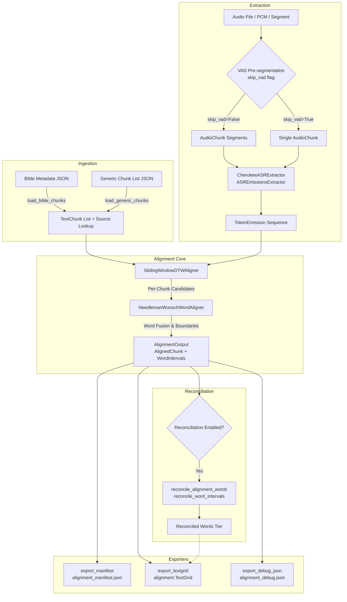

# Cherokee Audio-Text Alignment Engine (`transcription.alignment`)

The `transcription.alignment` package provides a high-performance, modular alignment and timestamping pipeline designed to align ground-truth Cherokee transcripts (such as story chunk lists, Bible verses, and conversational texts) against spoken audio recordings.

It combines Voice Activity Detection (VAD) audio pre-segmentation, acoustic CTC token emission extraction via [CherokeeASRModel](file:///Users/julietmcvicker/code/workshop-transcription/transcription/models/asr_model.py), 2D Sliding-Window Dynamic Time Warping (DTW) chunk alignment, and Needleman-Wunsch Dynamic Programming (DP) word-level fusion to calculate exact word- and chunk-level boundary timestamps.

---

## 1. Overview & Architecture

### High-Level Purpose

Speech-to-text models typically output raw acoustic token sequences that may contain deletions, insertions, or phonetic variation when compared with ground-truth written literature. The alignment engine bridges this gap by finding optimal alignments between ground-truth reference units and acoustic emissions, enabling:
- Automated creation of training datasets for ASR fine-tuning.
- Multi-tier Praat TextGrid annotation files for phonetic and linguistic analysis.
- Syllabary-to-speech phonetic reconciliation capturing syncopation and aspiration.

### Modular Functional Design

The engine follows a functional, decoupled design with pure dataclass models and explicit dependencies:



### Key Architectural Strengths

1. **Pure Domain Models**: Core algorithms operate on [`TextChunk`](file:///Users/julietmcvicker/code/workshop-transcription/transcription/alignment/models.py#L21-L27) and [`TokenEmission`](file:///Users/julietmcvicker/code/workshop-transcription/transcription/alignment/models.py#L11-L19) models, completely agnostic to dataset-specific metadata structures (e.g. verse numbers, book chapters, story speaker tags).
2. **Pluggable Normalization & Distance Metrics**: Word and chunk distance scoring are parameterized via the [`DistanceMetric`](file:///Users/julietmcvicker/code/workshop-transcription/transcription/alignment/distance_metrics.py#L9-L16) protocol, allowing Character Error Rate (CER), Levenshtein edit distance with custom substitution weights, or arbitrary callables.
3. **Multi-to-Multi DP Fusion**: The word aligner dynamically solves $1$-to-$N$ and $M$-to-$1$ ASR token-to-word grouping discrepancies with configurable fusion penalties and gap costs.
4. **Isolated Outbound Exporters**: Exporters receive pure [`AlignmentOutput`](file:///Users/julietmcvicker/code/workshop-transcription/transcription/alignment/models.py#L65-L73) objects and output directories, generating Praat TextGrids and JSON manifests without coupling to alignment execution.
5. **Language-Agnostic Extraction Schemas & Protocols**: While `CherokeeASRModel` is the dedicated Cherokee acoustic model, the output schemas and alignment protocols ([`TokenEmission`](file:///Users/julietmcvicker/code/workshop-transcription/transcription/alignment/models.py#L11-L19), [`ASRResult`](file:///Users/julietmcvicker/code/workshop-transcription/transcription/models/asr_model.py#L21-L32), [`SlidingWindowDTWAligner`](file:///Users/julietmcvicker/code/workshop-transcription/transcription/alignment/aligner.py#L129-L232)) are language-agnostic. Downstream Cherokee Syllabary transliteration and phonetic rule reconciliation are explicitly performed by `transcription.syllabary_enrichment` and `transcription.utils.syllabary_map`.

### Module Map

| Module | File | Purpose |
| --- | --- | --- |
| Models | [`models.py`](file:///Users/julietmcvicker/code/workshop-transcription/transcription/alignment/models.py) | Pure dataclasses: `TextChunk`, `TokenEmission`, `WordInterval`, `AlignedChunk`, `AlignmentMetrics`, `AlignmentOutput`. |
| Aligners | [`aligner.py`](file:///Users/julietmcvicker/code/workshop-transcription/transcription/alignment/aligner.py) | `NeedlemanWunschWordAligner` (word DP) and `SlidingWindowDTWAligner` (chunk DTW). |
| Extractors | [`extractors.py`](file:///Users/julietmcvicker/code/workshop-transcription/transcription/alignment/extractors.py) | `ASREmissionsExtractor` protocol, `CherokeeASRExtractor`, `CallbackEmissionsExtractor`, `PrecomputedEmissionsExtractor`, `prepare_audio_chunks`. |
| Metrics | [`distance_metrics.py`](file:///Users/julietmcvicker/code/workshop-transcription/transcription/alignment/distance_metrics.py) | `DistanceMetric` protocol, `DefaultCERDistanceMetric`, `LevenshteinDistanceMetric`, `CustomCallableDistanceMetric`, `calculate_cer`. |
| Normalizers | [`normalizers.py`](file:///Users/julietmcvicker/code/workshop-transcription/transcription/alignment/normalizers.py) | `normalize_syllabary_for_alignment` (aspiration stripped), `normalize_phonetics_for_alignment` (aspiration preserved), and `normalize_text_for_alignment` (compat alias). |
| Ingestion | [`ingestion.py`](file:///Users/julietmcvicker/code/workshop-transcription/transcription/alignment/ingestion.py) | `prepare_alignment_input` (sum-type dispatcher & normalizer resolver), `load_bible_chunks`, and `load_generic_chunks`. |
| Reconciliation | [`reconciliation.py`](file:///Users/julietmcvicker/code/workshop-transcription/transcription/alignment/reconciliation.py) | `reconcile_word_intervals`, `reconcile_alignment_words`, `reconcile_alignment_by_chunk`. |
| Exporters | [`exporters.py`](file:///Users/julietmcvicker/code/workshop-transcription/transcription/alignment/exporters.py) | `export_manifest`, `export_textgrid` (multi-tier Praat), `export_debug_json`. |
| CLI / Pipeline | [`cli.py`](file:///Users/julietmcvicker/code/workshop-transcription/transcription/alignment/cli.py) | `run_alignment_pipeline` orchestrator and `align-cherokee` CLI entrypoint. |

---

## 2. Core Domain Models (`transcription.alignment.models`)

All domain models are implemented as pure Python dataclasses in [`transcription/alignment/models.py`](file:///Users/julietmcvicker/code/workshop-transcription/transcription/alignment/models.py).

### Model Definitions

```python
from dataclasses import dataclass, field
from typing import List, Optional

@dataclass(frozen=True)
class TokenEmission:
    """An individual token or word emitted by the ASR model with timestamp bounds."""
    word: str
    start_sec: float
    end_sec: float
    confidence: float = 1.0

@dataclass(frozen=True)
class TextChunk:
    """Generic text unit to be aligned against audio/emissions."""
    chunk_id: str
    text: str

@dataclass
class WordInterval:
    """Aligned word token with start/end bounds and emitted token details."""
    word: str
    start_sec: float
    end_sec: float
    confidence: float = 1.0
    flagged: bool = False
    emitted_word: Optional[str] = None

@dataclass
class AlignedChunk:
    """A matched segment with bounded timestamps and aligned words."""
    chunk_id: str
    start_sec: float
    end_sec: float
    words: List[WordInterval] = field(default_factory=list)
    distance_score: float = 1.0
    emitted_text: str = ""

@dataclass
class AlignmentMetrics:
    """Quality metrics across aligned chunks."""
    total_chunks: int
    matched_chunks: int
    match_ratio: float
    mean_distance_score: float
    total_ground_truth_chars: int
    total_emitted_chars: int

@dataclass
class AlignmentOutput:
    """Final output from alignment execution."""
    aligned_chunks: List[AlignedChunk]
    source_id: str = ""
    raw_tokens: List[TokenEmission] = field(default_factory=list)
    metrics: Optional[AlignmentMetrics] = None
```

### Model Field Descriptions

| Model | Field | Type | Description |
| --- | --- | --- | --- |
| `TokenEmission` | `word` | `str` | Token or word emitted by the acoustic model. |
| | `start_sec` | `float` | Start time in seconds relative to recording start. |
| | `end_sec` | `float` | End time in seconds relative to recording start. |
| | `confidence` | `float` | Posterior probability or confidence score ($0.0 \dots 1.0$, default `1.0`). |
| `TextChunk` | `chunk_id` | `str` | Unique string identifier for the text segment (e.g. `"020101"`, `"chunk_001"`). |
| | `text` | `str` | Reference text content to align. |
| `WordInterval` | `word` | `str` | Ground-truth or reconciled word text. |
| | `start_sec` | `float` | Start timestamp in seconds. |
| | `end_sec` | `float` | End timestamp in seconds. |
| | `confidence` | `float` | Average acoustic confidence of matched emissions. |
| | `flagged` | `bool` | `True` if confidence is below threshold ($< 0.5$) or unaligned. |
| | `emitted_word` | `Optional[str]` | The raw ASR token text matched to this word. |
| `AlignedChunk` | `chunk_id` | `str` | Identifier matching source `TextChunk.chunk_id`. |
| | `start_sec` | `float` | Start timestamp of first matched token. |
| | `end_sec` | `float` | End timestamp of last matched token. |
| | `words` | `List[WordInterval]` | List of constituent word-level intervals. |
| | `distance_score` | `float` | Distance score (e.g. CER) between hypothesis and reference. |
| | `emitted_text` | `str` | Space-concatenated raw tokens matched to chunk. |
| `AlignmentMetrics`| `total_chunks` | `int` | Total count of reference chunks. |
| | `matched_chunks` | `int` | Count of chunks with valid matched words ($end > start$). |
| | `match_ratio` | `float` | Ratio of matched chunks (`matched_chunks / total_chunks`). |
| | `mean_distance_score` | `float` | Average distance score across matched chunks. |
| | `total_ground_truth_chars` | `int` | Total character count of normalized matched GT chunks. |
| | `total_emitted_chars` | `int` | Total character count of normalized matched emissions. |
| `AlignmentOutput` | `aligned_chunks` | `List[AlignedChunk]` | List of aligned chunk objects in sequential order. |
| | `source_id` | `str` | Identifier or file path of the source audio. |
| | `raw_tokens` | `List[TokenEmission]`| Unfiltered sequential list of all ASR emissions. |
| | `metrics` | `Optional[AlignmentMetrics]`| Aggregate quality metrics. |

---

## 3. Alignment Engines (`transcription.alignment.aligner`)

The alignment engine implements a two-stage hierarchical alignment:
1. **Chunk-Level Dynamic Time Warping (`SlidingWindowDTWAligner`)**: Finds optimal temporal boundaries for multi-word phrases or sentences within long audio.
2. **Word-Level Dynamic Programming (`NeedlemanWunschWordAligner`)**: Solves word-to-token correspondence and boundary interpolation within each matched chunk.

### `NeedlemanWunschWordAligner`

Aligns ground-truth words to matched emission tokens using an enhanced Needleman-Wunsch string edit DP matrix with $1$-to-$N$ and $M$-to-$1$ fusion.

```python
from transcription.alignment.aligner import NeedlemanWunschWordAligner
from transcription.alignment.distance_metrics import DefaultCERDistanceMetric
from transcription.alignment.normalizers import normalize_text_for_alignment

word_aligner = NeedlemanWunschWordAligner(
    distance_metric=DefaultCERDistanceMetric(),
    chunk_normalizer=normalize_text_for_alignment,
    emission_normalizer=normalize_text_for_alignment,
    gap_cost=0.8,
    max_fuse_gt=4,
    max_fuse_asr=3,
    fuse_penalty=0.15,
)
```

#### Constructor Parameters

- `distance_metric` (*Optional[DistanceMetric]*): Distance metric implementation. Defaults to `DefaultCERDistanceMetric()`.
- `chunk_normalizer` (*Optional[Callable[[str], str]]*): Text normalizer applied to ground-truth words before comparison. Defaults to identity `lambda s: s`.
- `emission_normalizer` (*Optional[Callable[[str], str]]*): Text normalizer applied to emission tokens before comparison. Defaults to identity `lambda s: s`.
- `gap_cost` (*float*): Cost penalty for unaligned ground-truth words or unaligned ASR tokens. Default: `0.8`.
- `max_fuse_gt` (*int*): Maximum number of contiguous ground-truth words allowed to fuse to match ASR tokens ($k \in [1, \text{max\_fuse\_gt}]$). Default: `4`.
- `max_fuse_asr` (*int*): Maximum number of contiguous ASR emission tokens allowed to fuse to match ground-truth words ($m \in [1, \text{max\_fuse\_asr}]$). Default: `3`.
- `fuse_penalty` (*float*): Penalty applied per additional fused element: `fuse_penalty * (k - 1) + fuse_penalty * (m - 1)`. Default: `0.15`.

#### DP Alignment Logic & Actions

The aligner constructs a 2D dynamic programming grid `dp[N+1, M+1]` where $N$ is the number of ground-truth words and $M$ is the number of emission tokens:

1. **Unaligned Ground-Truth Word (`gap_gt`)**:
   - Transition: `(i, j) -> (i + 1, j)` with cost `dp[i, j] + gap_cost`.
   - Result: Interpolates timestamp from the end of the previous word interval, sets `confidence=0.0`, and marks `flagged=True`.
2. **Unaligned ASR Token (`gap_token`)**:
   - Transition: `(i, j) -> (i, j + 1)` with cost `dp[i, j] + gap_cost`.
   - Result: Discarded as extraneous acoustic noise / insertion.
3. **Multi-to-Multi Match & Fusion (`match_fuse_k_m`)**:
   - Transition: `(i, j) -> (i + k, j + m)` with cost `dp[i, j] + edit_cost + penalty`.
   - Result: Creates a [`WordInterval`](file:///Users/julietmcvicker/code/workshop-transcription/transcription/alignment/models.py#L30-L39) spanning from `matched_tokens[j].start_sec` to `matched_tokens[j + m - 1].end_sec`. Confidence is computed as the mean confidence across the $m$ tokens.

#### Methods

- `align_words(raw_words: Sequence[str], matched_tokens: Sequence[TokenEmission]) -> List[WordInterval]`: Runs DP alignment and returns word intervals.
- `compute_cost(hypothesis: str, reference: str) -> float`: Evaluates distance cost between strings after applying normalizers.

---

### `SlidingWindowDTWAligner`

The chunk-level aligner maps sequential [`TextChunk`](file:///Users/julietmcvicker/code/workshop-transcription/transcription/alignment/models.py#L21-L27)s to an emission stream using a 2D sliding window search.

```python
from transcription.alignment.aligner import SlidingWindowDTWAligner

aligner = SlidingWindowDTWAligner(
    word_aligner=word_aligner,
    max_preamble_skip=30,
    max_normal_skip=5,
)
```

#### Constructor Parameters

- `word_aligner` (*Optional[NeedlemanWunschWordAligner]*): The word-level DP aligner used for distance scoring and word interval extraction. Defaults to `NeedlemanWunschWordAligner()`.
- `max_preamble_skip` (*int*): Maximum number of initial ASR tokens to search across when aligning the first chunk ($c\_idx = 0$). Allows skipping introductory music, spoken introductions, or silence. Default: `30`.
- `max_normal_skip` (*int*): Maximum token skip allowed between consecutive chunks ($c\_idx > 0$) to recover from skipped sentences or spoken filler. Default: `5`.

#### Alignment Algorithm

1. Maintains monotonic cursor `token_idx` into the `emissions` list.
2. For each chunk:
   - Sets skip search space: `max_skip = max_preamble_skip` if first chunk, else `max_normal_skip`.
   - Evaluates search window length $k \in [1, \min(\text{remaining\_tokens}, \max(\text{num\_words} \times 3, 10))]$.
   - Evaluates candidate emissions using both spaced (`" ".join(tok_words)`) and concatenated (`"".join(tok_words)`) representations against normalized chunk text:
     $$\text{cost} = \min\Big(\text{compute\_cost}(\text{spaced}, \text{ref}),\; \text{compute\_cost}(\text{concat}, \text{ref})\Big)$$
   - Selects window $[start\_idx, end\_idx]$ minimizing distance cost.
   - Delegates token slice to `word_aligner.align_words(raw_words, matched_tokens)`.
   - Advances `token_idx = best_end_idx`.
3. Computes summary metrics across all chunks and returns [`AlignmentOutput`](file:///Users/julietmcvicker/code/workshop-transcription/transcription/alignment/models.py#L65-L73).

#### Methods

- `align(emissions: Sequence[TokenEmission], chunks: Sequence[TextChunk], source_id: str = "") -> AlignmentOutput`: Executes alignment across all chunks and computes quality metrics.

---

## 4. Emission Extractors (`transcription.alignment.extractors`)

Emission extractors convert audio inputs into sequences of timestamped [`TokenEmission`](file:///Users/julietmcvicker/code/workshop-transcription/transcription/alignment/models.py#L11-L19) objects.

### `ASREmissionsExtractor` Protocol

```python
from typing import Any, List, Protocol, runtime_checkable
from transcription.alignment.models import TokenEmission

@runtime_checkable
class ASREmissionsExtractor(Protocol):
    """Protocol for extracting token emissions from audio input."""
    def extract(self, audio_input: Any = None) -> List[TokenEmission]:
        ...
```

### Audio Chunk Preparation (`prepare_audio_chunks`)

[`prepare_audio_chunks(audio_input: Any, skip_vad: bool = False) -> List[AudioChunk]`](file:///Users/julietmcvicker/code/workshop-transcription/transcription/alignment/extractors.py#L27-L62) is a utility supporting string file paths, `pydub.AudioSegment`, and `numpy.ndarray` audio inputs.

- **`skip_vad=False`**: Uses [`segment_long_audio`](file:///Users/julietmcvicker/code/workshop-transcription/transcription/audio/segment.py) VAD to segment audio into speech chunks separated by non-speech intervals.
- **`skip_vad=True`**: Wraps the entire audio into a single `AudioChunk(chunk_index=0, start_sec=0.0, end_sec=...)`, bypassing VAD segmentation. Ideal for short pre-cut audio clips.

### Concrete Extractors

#### 1. `CherokeeASRExtractor`
Wraps [`CherokeeASRModel`](file:///Users/julietmcvicker/code/workshop-transcription/transcription/models/asr_model.py) for direct model inference:

```python
from transcription.alignment.extractors import CherokeeASRExtractor
from transcription.models.asr_model import CherokeeASRModel

model = CherokeeASRModel.from_pretrained("charliemcvicker/asr-cherokee")
extractor = CherokeeASRExtractor(model=model, skip_vad=False)
emissions = extractor.extract("audio/recording.wav")
```

#### 2. `CallbackEmissionsExtractor`
Wraps any callable `(samples: np.ndarray, sample_rate: int) -> List[TokenEmission | dict | Any]`:

```python
from transcription.alignment.extractors import CallbackEmissionsExtractor

def custom_infer_callback(samples, sample_rate):
    # Run custom inference logic
    return [{"word": "osiyo", "start_time": 0.2, "end_time": 0.8, "confidence": 0.95}]

extractor = CallbackEmissionsExtractor(callback=custom_infer_callback, skip_vad=True)
emissions = extractor.extract("audio/recording.wav")
```

#### 3. `PrecomputedEmissionsExtractor`
Loads precomputed tokens or dicts without performing audio inference (ideal for unit testing and offline workflows):

```python
from transcription.alignment.extractors import PrecomputedEmissionsExtractor
from transcription.alignment.models import TokenEmission

tokens = [
    TokenEmission(word="osiyo", start_sec=0.2, end_sec=0.8, confidence=0.95),
    TokenEmission(word="tohiju", start_sec=0.9, end_sec=1.4, confidence=0.92),
]
extractor = PrecomputedEmissionsExtractor(token_emissions=tokens)
emissions = extractor.extract()
```

---

## 5. Distance Metrics & Normalization

### `DistanceMetric` Protocol

Located in [`transcription/alignment/distance_metrics.py`](file:///Users/julietmcvicker/code/workshop-transcription/transcription/alignment/distance_metrics.py):

```python
from typing import Protocol, runtime_checkable

@runtime_checkable
class DistanceMetric(Protocol):
    """Protocol for distance cost evaluation between hypothesis and reference."""
    def compute_cost(self, hypothesis: str, reference: str) -> float:
        ...
```

### Implementations

#### `DefaultCERDistanceMetric` (Alias: `CharacterErrorRateMetric`)
Computes Character Error Rate using `jiwer.cer(reference, hypothesis)`.

```python
from transcription.alignment.distance_metrics import DefaultCERDistanceMetric, calculate_cer

metric = DefaultCERDistanceMetric()
cost = metric.compute_cost(hypothesis="osyo", reference="osiyo")  # ~0.20

# Standalone function
raw_cer = calculate_cer("osyo", "osiyo")
```

- Returns `0.0` when both strings are empty.
- Returns `1.0` when one string is empty and the other is non-empty.

#### `LevenshteinDistanceMetric` (Alias: `PhonologicalDistanceMetric`)
Implements weighted dynamic programming edit distance normalized by reference length:

```python
from transcription.alignment.distance_metrics import LevenshteinDistanceMetric

custom_metric = LevenshteinDistanceMetric(
    substitution_weights={
        ("k", "g"): 0.2,
        ("t", "d"): 0.2,
        ("qu", "gw"): 0.1,
    },
    insertion_cost=1.0,
    deletion_cost=1.0,
    default_substitution_cost=1.0,
)
cost = custom_metric.compute_cost(hypothesis="ga", reference="ka")  # 0.1
```

#### `CustomCallableDistanceMetric`
Adapts any standard `(hypothesis: str, reference: str) -> float` callable:

```python
from transcription.alignment.distance_metrics import CustomCallableDistanceMetric

metric = CustomCallableDistanceMetric(fn=lambda hyp, ref: 0.0 if hyp == ref else 0.5)
```

---

### Representation-Aware Text Normalization (`transcription.alignment.normalizers`)

Located in [`transcription/alignment/normalizers.py`](file:///Users/julietmcvicker/code/workshop-transcription/transcription/alignment/normalizers.py), normalization functions prepare text for robust acoustic DTW and dynamic programming alignment. Because Cherokee Syllabary orthography does not reliably differentiate aspiration, separate normalizers are provided based on the input representation:

#### 1. `normalize_syllabary_for_alignment` (Syllabary Mode)
Used when aligning Syllabary transliterations (such as Bible verse metadata). Because Syllabary orthography cannot be trusted to mark aspiration consistently, aspiration (`h`) is normalized away:
1. **Lowercasing and Hyphen Stripping**: `A-da-le-ni-s-gv` $\rightarrow$ `adalenisgv`.
2. **Digraph Normalization**: Replaces `qu` with `gw`.
3. **Consonant Respelling**: Calls [`respell_consonants`](file:///Users/julietmcvicker/code/workshop-transcription/transcription/utils/tone_normalization.py) (`t->th`, `d->t`, `k->kh`, `g->k`, etc.).
4. **Aspiration Stripping**: Strips `/h/` sound markers (`text.replace("h", "")`).
5. **Punctuation Removal**: Strips standard punctuation (`.,!?;:"'()[]{}` etc.).
6. **Whitespace Normalization**: Collapses whitespace into single spaces and strips ends.

#### 2. `normalize_phonetics_for_alignment` (Phonetics Mode)
Used when aligning phonetic transcripts against acoustic ASR token emissions (such as linguistic transcriptions or interview segments). Aspiration (`h`) is **preserved** because both the reference and the ASR emissions contain meaningful phonetic contrast:
1. **Lowercasing and Hyphen Stripping**: `tsa-ni` $\rightarrow$ `tsani`.
2. **Digraph Normalization**: Replaces `qu` with `gw`.
3. **Consonant Respelling**: Applies phonetic consonant mappings without stripping `h`.
4. **Punctuation Removal & Whitespace**: Sanitizes punctuation and normalizes spacing.

*Note: [`normalize_text_for_alignment`](file:///Users/julietmcvicker/code/workshop-transcription/transcription/alignment/normalizers.py) is retained as a backwards-compatible alias for `normalize_syllabary_for_alignment`.*

---

## 6. Ground-Truth Ingestion (`transcription.alignment.ingestion`)

Ingestion utilities load reference text from JSON files, dictionaries, or lists into standardized [`TextChunk`](file:///Users/julietmcvicker/code/workshop-transcription/transcription/alignment/models.py#L21-L27) lists and source metadata lookup maps.

### `prepare_alignment_input` (Sum-Type Dispatcher)

The primary entrypoint for source ingestion. It accepts sum-type arguments (`bible_metadata` vs `chunk_list`), loads the chunks, and resolves the appropriate representation-aware normalizers:

```python
from transcription.alignment.ingestion import prepare_alignment_input

chunks, source_lookup, chunk_normalizer, emissions_normalizer = prepare_alignment_input(
    bible_metadata="data/book_transcripts/02_Mark/0201.json",
    # OR: chunk_list="timestamping_test_data/fishing_story.json"
)
```

- **When `bible_metadata` is supplied**: Returns `(chunks, source_lookup, normalize_syllabary_for_alignment, normalize_syllabary_for_alignment)`.
- **When `chunk_list` is supplied**: Returns `(chunks, source_lookup, normalize_phonetics_for_alignment, normalize_phonetics_for_alignment)`.

---

### `load_generic_chunks`

Loads generic chunk lists (story segments, dialogues, sentences):

```python
from transcription.alignment.ingestion import load_generic_chunks
from transcription.alignment.normalizers import normalize_phonetics_for_alignment

chunks, source_lookup = load_generic_chunks(
    source="timestamping_test_data/fishing_story.json",
    normalizer=normalize_phonetics_for_alignment,
)
```

#### Expected Input Format (List or Dict)
```json
[
  {
    "chunk_id": "chunk_001",
    "raw_text": "tsani ahwesolvtanvi",
    "cherokee_syllabary": "ᏣᏂ ᎠᏪᏐᎸᏔᏅᎢ",
    "english": "John was fishing"
  },
  {
    "chunk_id": "chunk_002",
    "raw_text": "gadu unadanvdli",
    "cherokee_syllabary": "ᎦᏚ ᎤᎾᏓᏅᏟ"
  }
]
```
*Supported chunk ID keys: `chunk_id`, `line_id`, `id`.*  
*Supported text keys: `raw_text`, `raw_phonetic`, `phonetic`, `text`.*

---

### `load_bible_chunks`

Loads Bible verse metadata dictionaries:

```python
from transcription.alignment.ingestion import load_bible_chunks
from transcription.alignment.normalizers import normalize_syllabary_for_alignment

chunks, source_lookup = load_bible_chunks(
    source="data/book_transcripts/02_Mark/0201.json",
    normalizer=normalize_syllabary_for_alignment,
)
```

#### Expected Input Format (Key-Value Dict)
```json
{
  "020101": {
    "english": "The beginning of the gospel of Jesus Christ, the Son of God;",
    "cherokee": "ᎠᏓᎴᏂᏍᎬ ᏱᏍᏛ ᎧᏃᎮᏛ, ᏥᏌ ᎦᎶᏁᏛ ᎤᏁᎳᏅᎯ ᎤᏪᏥ ᎤᏤᎵᎦ.",
    "phonetic": "A-da-le-ni-s-gv yi-s-dv ka-no-he-dv, Tsi-sa Ga-lo-ne-dv U-ne-la-nv-hi U-we-tsi u-tse-li-ga."
  },
  "020102": {
    "english": "As it is written in the prophets...",
    "cherokee": "ᎾᏍᎩᏯ ᏥᏂᎬᏅ ᏥᎪᏪᎳ ᎠᎾᏙᎴᎰᏍᎩᏱ...",
    "phonetic": "Na-s-gi-ya tsi-ni-gv-nv tsi-go-we-la a-na-do-le-ho-s-gi-yi..."
  }
}
```

---

## 7. Syllabary Phonetic Reconciliation (`transcription.alignment.reconciliation`)

Spoken Cherokee frequently undergoes phonological processes (vowel syncopation, pre-aspiration, post-vocalic aspiration) that cause acoustic pronunciations to diverge from base transliterations.

The reconciliation module maps ground-truth Cherokee Syllabary against aligned words to produce enriched phonetic spellings while keeping syllabary structural anchors intact.

### Reconciliation Functions

```python
from transcription.alignment.reconciliation import (
    reconcile_word_intervals,
    reconcile_alignment_words,
    reconcile_alignment_by_chunk,
)
```

#### `reconcile_word_intervals`
```python
def reconcile_word_intervals(
    words: Sequence[WordInterval],
    syllabary_text: str,
) -> List[WordInterval]:
    """Pure mapping: returns new WordIntervals with reconciled phonetics in `word`."""
```
- Splits `syllabary_text` into words.
- Uses character-syllable dynamic programming alignment ([`align_character_syllable`](file:///Users/julietmcvicker/code/workshop-transcription/transcription/syllabary_enrichment/alignment_engine.py)) and phonetic rule merger ([`reconcile_phonetics`](file:///Users/julietmcvicker/code/workshop-transcription/transcription/syllabary_enrichment/enrich_syllabary.py)).
- Returns new, immutable [`WordInterval`](file:///Users/julietmcvicker/code/workshop-transcription/transcription/alignment/models.py#L30-L39) instances with reconciled word strings.

#### `reconcile_alignment_words`
```python
def reconcile_alignment_words(
    alignment: AlignmentOutput,
    syllabary_lookup: Dict[str, str],
) -> List[WordInterval]:
    """Reconciles all words across chunks, returning a single flattened list."""
```

#### `reconcile_alignment_by_chunk`
```python
def reconcile_alignment_by_chunk(
    alignment: AlignmentOutput,
    syllabary_lookup: Dict[str, str],
) -> Dict[str, List[WordInterval]]:
    """Returns a dictionary mapping chunk_id to its reconciled WordInterval list."""
```

---

## 8. Outbound Exporters (`transcription.alignment.exporters`)

Outbound exporters generate structured outputs from an [`AlignmentOutput`](file:///Users/julietmcvicker/code/workshop-transcription/transcription/alignment/models.py#L65-L73) object.

```python
from transcription.alignment.exporters import (
    export_manifest,
    export_textgrid,
    export_debug_json,
)
```

### 1. `export_manifest` (`alignment_manifest.json`)

Generates a JSON manifest file containing chunk and word timestamps, metadata, quality metrics, and optional additional word tiers (such as reconciled words):

```python
manifest_path = export_manifest(
    alignment=alignment,
    output_dir="output/alignment_run",
    filename="alignment_manifest.json",
    source_metadata=source_lookup,
    additional_word_tiers={"Reconciled Words": reconciled_words},
)
```

#### Manifest Structure
```json
{
  "audio_source": "timestamping_test_data/fishing_story.wav",
  "metrics": {
    "total_chunks": 12,
    "matched_chunks": 12,
    "match_ratio": 1.0,
    "mean_distance_score": 0.042,
    "total_ground_truth_chars": 850,
    "total_emitted_chars": 842
  },
  "additional_word_tiers": {
    "Reconciled Words": [
      {
        "word": "tsáni",
        "start": 0.45,
        "end": 1.10,
        "confidence": 0.98,
        "flagged": false
      }
    ]
  },
  "reconciled_words": [
    {
      "word": "tsáni",
      "start": 0.45,
      "end": 1.10,
      "confidence": 0.98,
      "flagged": false
    }
  ],
  "lines": [
    {
      "line_id": "chunk_001",
      "cherokee_syllabary": "ᏣᏂ ᎠᏪᏐᎸᏔᏅᎢ",
      "text": "tsani ahwesolvtanvi",
      "english": "John went fishing",
      "start": 0.45,
      "end": 3.12,
      "cer": 0.0,
      "emitted_text": "tsani ahwesolvtanvi",
      "words": [
        {
          "word": "tsani",
          "start": 0.45,
          "end": 1.10,
          "confidence": 0.98,
          "flagged": false,
          "emitted_word": "tsani",
          "reconciled_word": "tsáni"
        }
      ],
      "additional_word_tiers": {
        "Reconciled Words": [
          {
            "word": "tsáni",
            "start": 0.45,
            "end": 1.10,
            "confidence": 0.98,
            "flagged": false
          }
        ]
      },
      "reconciled_words": [
        {
          "word": "tsáni",
          "start": 0.45,
          "end": 1.10,
          "confidence": 0.98,
          "flagged": false
        }
      ]
    }
  ]
}
```

---

### 2. `export_textgrid` (`alignment.TextGrid`)

Generates a multi-tier Praat `ooTextFile` TextGrid format:

```python
textgrid_path = export_textgrid(
    alignment=alignment,
    output_dir="output/alignment_run",
    filename="alignment.TextGrid",
    pad_sec=0.10,
    source_metadata=source_lookup,
    additional_word_tiers={"Reconciled Words": reconciled_words},
)
```

#### Praat TextGrid Tiers

```
┌────────────────────────────────────────────────────────┐
│ Tier 1: Chunks           [001: tsani ahwesolvtanvi]    │
├────────────────────────────────────────────────────────┤
│ Tier 2: Words            [tsani]      [ahwesolvtanvi]  │
├────────────────────────────────────────────────────────┤
│ Tier 3: Padded Words     [  tsani  ]  [ ahwesolvtanvi ]│
├────────────────────────────────────────────────────────┤
│ Tier 4: Reconciled Words [tsáni]      [àhwesolvhtanv́ʔi]│ (When reconciled)
├────────────────────────────────────────────────────────┤
│ Tier 5: Raw ASR Emissions[tsani]      [ahwesolvtanvi]  │
└────────────────────────────────────────────────────────┘
```

- **Tier 1 (Chunks)**: Boundaries for each aligned text chunk.
- **Tier 2 (Words)**: Ground-truth word boundaries.
- **Tier 3 (Padded Words)**: Words expanded by `pad_sec` (default $0.10\text{s}$) with temporal fusion for audio slicing without clipping consonants.
- **Tier 4 (Reconciled Words)**: (*Optional*) Enriched phonetic words matching syllabary to acoustic emissions.
- **Tier 5 (Raw ASR Emissions)**: Exact raw CTC acoustic emissions from the ASR model.

---

### 3. `export_debug_json` (`alignment_debug.json`)

Writes diagnostic token dumps for inspection and debugging:

```python
debug_path = export_debug_json(
    alignment=alignment,
    output_dir="output/alignment_run",
    filename="alignment_debug.json",
)
```

---

## 9. CLI Reference (`align-cherokee`)

The `align-cherokee` command is registered in `pyproject.toml` and points to [`transcription.alignment.cli:main`](file:///Users/julietmcvicker/code/workshop-transcription/transcription/alignment/cli.py).

### Flag Reference Table

| Option | Flag | Type | Description |
| --- | --- | --- | --- |
| Audio File | `--audio` | `str` (required) | Path to input audio file (`.wav`, `.mp3`). |
| Chunk List | `--chunk-list` | `str` (mutually exclusive) | Path to generic chunk list JSON (e.g. story chunks). |
| Bible Metadata | `--bible-metadata` / `--metadata` | `str` (mutually exclusive) | Path to Bible metadata JSON dictionary. |
| Output Directory | `--output-dir` | `str` (required) | Directory where artifacts will be saved. |
| Praat Export | `--export-praat` | `flag` (default: `True`) | Export Praat `.TextGrid` file. |
| Custom Model | `--model-path` | `str` (optional) | Custom Wav2Vec2 checkpoint path or Hugging Face repo ID. |
| Skip VAD | `--skip-vad` | `flag` (default: `False`) | Bypass VAD segmentation (recommended for pre-cut clips). |
| Phonetic Reconciliation | `--reconcile` | `flag` (default: `False`) | Reconcile syllabary with ASR emissions and add Reconciled Words tier. |
| Debug Export | `--debug-export` | `flag` (default: `False`) | Save `alignment_debug.json` with raw tokens and counts. |

---

### CLI Usage Examples

#### 1. Align Story Recording with Chunk List & Syllabary Reconciliation
```bash
align-cherokee \
  --audio "timestamping_test_data/Cherokee Story-Our Fishing Trip.wav" \
  --chunk-list "timestamping_test_data/fishing_story.json" \
  --output-dir "output/fishing" \
  --reconcile
```

#### 2. Align Bible Chapter Recording
```bash
align-cherokee \
  --audio "data/raw/audio_books/02_Mark/0201.mp3" \
  --bible-metadata "data/book_transcripts/02_Mark/0201.json" \
  --output-dir "output/mark_01" \
  --reconcile \
  --debug-export
```

#### 3. Fast Alignment for Pre-Cut Audio Clips (`--skip-vad`)
```bash
align-cherokee \
  --audio "data/processed/sentence_audio/Sentence_1136_01.wav" \
  --chunk-list "data/processed/single_sentence_chunk.json" \
  --output-dir "output/sentence_1136" \
  --skip-vad
```

#### 4. Custom Local Model Checkpoint
```bash
align-cherokee \
  --audio "data/raw/recording.wav" \
  --chunk-list "data/processed/chunks.json" \
  --output-dir "output/custom_run" \
  --model-path "output_w2v2/checkpoint-800"
```

---

## 10. Programmatic Python API

The `transcription.alignment` package supports both high-level one-line execution and fine-grained modular pipelines.

### High-Level Execution (`run_alignment_pipeline`)

```python
from transcription.alignment import run_alignment_pipeline

alignment = run_alignment_pipeline(
    audio_path="timestamping_test_data/Cherokee Story-Our Fishing Trip.wav",
    output_dir="output/fishing_pipeline",
    chunk_list_path="timestamping_test_data/fishing_story.json",
    export_praat=True,
    export_manifest=True,
    skip_vad=False,
    reconcile=True,
    debug_export=True,
)

if alignment.metrics:
    print(f"Matched {alignment.metrics.matched_chunks}/{alignment.metrics.total_chunks} chunks.")
    print(f"Mean distance score: {alignment.metrics.mean_distance_score:.4f}")
```

---

### Low-Level Modular Execution

```python
from transcription.alignment import (
    CherokeeASRExtractor,
    NeedlemanWunschWordAligner,
    SlidingWindowDTWAligner,
    export_manifest,
    export_textgrid,
    prepare_alignment_input,
    reconcile_alignment_words,
)
from transcription.models.asr_model import CherokeeASRModel

# Step 1: Ingest ground-truth chunks & resolve representation-aware normalizers
chunks, source_lookup, chunk_norm, emission_norm = prepare_alignment_input(
    chunk_list="timestamping_test_data/fishing_story.json"
)

# Step 2: Load ASR model and extract acoustic token emissions
model = CherokeeASRModel.from_pretrained_or_best("charliemcvicker/asr-cherokee")
extractor = CherokeeASRExtractor(model=model, skip_vad=False)
emissions = extractor.extract("timestamping_test_data/Cherokee Story-Our Fishing Trip.wav")

# Step 3: Configure word and chunk DP alignment engines
word_aligner = NeedlemanWunschWordAligner(
    chunk_normalizer=chunk_norm,
    emission_normalizer=emission_norm,
    gap_cost=0.8,
    fuse_penalty=0.15,
)
aligner = SlidingWindowDTWAligner(
    word_aligner=word_aligner,
    max_preamble_skip=30,
    max_normal_skip=5,
)

# Step 4: Run alignment
alignment = aligner.align(
    emissions=emissions,
    chunks=chunks,
    source_id="timestamping_test_data/Cherokee Story-Our Fishing Trip.wav",
)

# Step 5: Perform Syllabary Phonetic Reconciliation
syllabary_lookup = {
    cid: meta.get("cherokee_syllabary", meta.get("cherokee", ""))
    for cid, meta in source_lookup.items()
}
reconciled_words = reconcile_alignment_words(alignment, syllabary_lookup)

# Step 6: Export Praat TextGrid and Manifest
output_dir = "output/fishing_modular"
export_manifest(
    alignment=alignment,
    output_dir=output_dir,
    source_metadata=source_lookup,
    additional_word_tiers={"Reconciled Words": reconciled_words},
)
export_textgrid(
    alignment=alignment,
    output_dir=output_dir,
    source_metadata=source_lookup,
    additional_word_tiers={"Reconciled Words": reconciled_words},
)
print(f"Alignment exported successfully to {output_dir}/")
```

---

### Customizing Distance Metrics and Normalization

You can inject custom distance metrics, such as a phonologically weighted edit distance:

```python
from transcription.alignment import (
    LevenshteinDistanceMetric,
    NeedlemanWunschWordAligner,
    SlidingWindowDTWAligner,
)

# Custom phonetic substitution penalties
phonetic_metric = LevenshteinDistanceMetric(
    substitution_weights={
        ("k", "g"): 0.15,
        ("t", "d"): 0.15,
        ("s", "sh"): 0.20,
        ("qu", "gw"): 0.10,
    },
    default_substitution_cost=1.0,
)

word_aligner = NeedlemanWunschWordAligner(
    distance_metric=phonetic_metric,
    chunk_normalizer=lambda s: s.lower().strip(),
    emission_normalizer=lambda s: s.lower().strip(),
)
aligner = SlidingWindowDTWAligner(word_aligner=word_aligner)
```

---

### In-Memory / Precomputed Token Alignment

For offline testing, batch caching, or non-audio pipelines, bypass acoustic extraction using [`PrecomputedEmissionsExtractor`](file:///Users/julietmcvicker/code/workshop-transcription/transcription/alignment/extractors.py#L204-L244):

```python
from transcription.alignment import (
    NeedlemanWunschWordAligner,
    PrecomputedEmissionsExtractor,
    SlidingWindowDTWAligner,
    TextChunk,
    TokenEmission,
)

# 1. Define precomputed tokens
raw_tokens = [
    TokenEmission(word="tsani", start_sec=0.2, end_sec=0.8, confidence=0.98),
    TokenEmission(word="ahwesolvtanvi", start_sec=0.9, end_sec=2.1, confidence=0.92),
]
extractor = PrecomputedEmissionsExtractor(token_emissions=raw_tokens)
emissions = extractor.extract()

# 2. Define text chunk
chunks = [TextChunk(chunk_id="line_01", text="tsani ahwesolvtanvi")]

# 3. Align directly
aligner = SlidingWindowDTWAligner(word_aligner=NeedlemanWunschWordAligner())
alignment = aligner.align(emissions=emissions, chunks=chunks, source_id="in_memory_sample")

print(f"Aligned chunk start: {alignment.aligned_chunks[0].start_sec}s, end: {alignment.aligned_chunks[0].end_sec}s")
```
